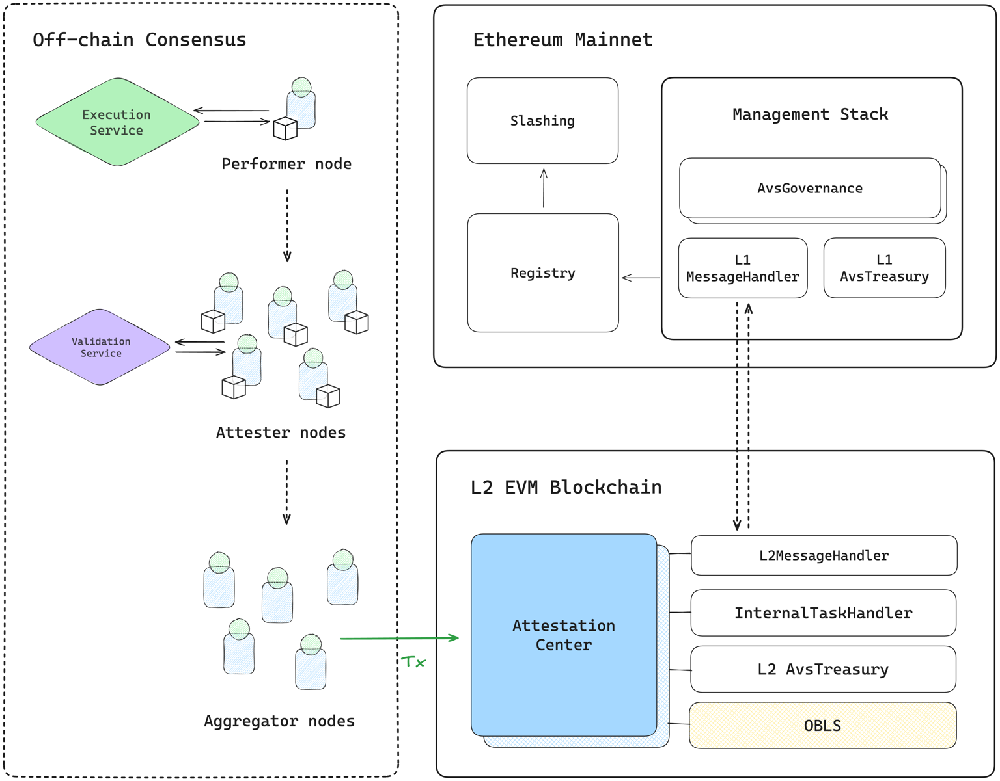

<p align="center">
  <a href="https://www.othentic.xyz/"></a> 
</p>

<h4 align="center">The Development Framework for Distributed Systems</h4>

<p align="center">
  <a href="https://docs.othentic.xyz/main">
    Docs
  </a>
</p>

<p align="center">
  <a href="#packages">Packages</a> •
  <a href="#contracts">Contracts</a> •
  <a href="#contributing">Contributing</a> •
  <a href="#security">Security</a> •
  <a href="#license">License</a>
</p>

---
[Othentic](https://www.othentic.xyz/) is a development framework designed for building robust distributed systems that integrate with Shared security protocols. The network's governance is implemented by AvsGovernance, which is the endpoint for network members' management and deposits. The network has the ability to control stake tokens, depending on the performance of tasks, and vote against bad acting.

To reduce costs and improve efficiency, we deploy `AvsGovernance` on Layer 1 and `AttestationCenter` on Layer 2. Since they run on separate networks and can't interact directly on-chain, we use `LayerZero` to handle message passing between them.
<div align="center">
  <a href="https://docs.othentic.xyz/main/avs-framework/smart-contracts/avs-governance">
    
  </a>
</div>


# Packages
The core contracts fall into the following categories in the GitHub repository:

| Package | Description |
| --- | --- |
| [src/NetworkManagement/L1](https://github.com/Othentic-Labs/core-contracts/tree/main/src/NetworkManagement/L1) | Layer 1 contract implementations | 
| [src/NetworkManagement/L2](https://github.com/Othentic-Labs/core-contracts/tree/main/src/NetworkManagement/L2) | Layer 2 contract implementations  |
| [src/NetworkManagement/lz](https://github.com/Othentic-Labs/core-contracts/tree/main/src/lz) | LayerZero-based messaging interfaces between L1 and L2 |


# Contracts

## Layer 1 Components — Governance Layer

1. ```AvsGovernance```: The core governance contract for the AVS that manages Operator registrations, Stake deposits and withdrawals and Protocol-level decision making

## Layer2 Components — Task & Attestation Layer

1. ```AttestationCenter``` is a contract on Layer 2 that is manage tasks of the AVS validators. It informed by the validators about historical tasks executions and votes 
2. ```OBLS``` is the contract that implements multisig operations
3. ```BN256G2``` is a cryptographic logical contract that used by ```OBLS```.

## Inter-Layer Communications
Othentic uses LayerZero protocol to facilitate secure cross-layer messaging:

1. ```l1MessageHandler``` Connected to `AvsGovernance`, it is an endpoint for communication with Layer 2 components. When activate it act like a router and also a broadcast for Layer 2.
2. ```l2MessageHandler``` Connected to `AttestationCenter`, this contract is the complement contract to ```l1MessageHandler```, an endpoint for communication with Layer 1.

### Message Flow

Communication between layers follows this pattern:

```
// From Layer 2 → Layer 1
L2MessageHandler.sendMessage(payload)
   ⟶ L1MessageHandler.receive(payload)

// From Layer 1 → Layer 2
L1MessageHandler.sendMessage(payload)
   ⟶ L2MessageHandler.receive(payload)
```

